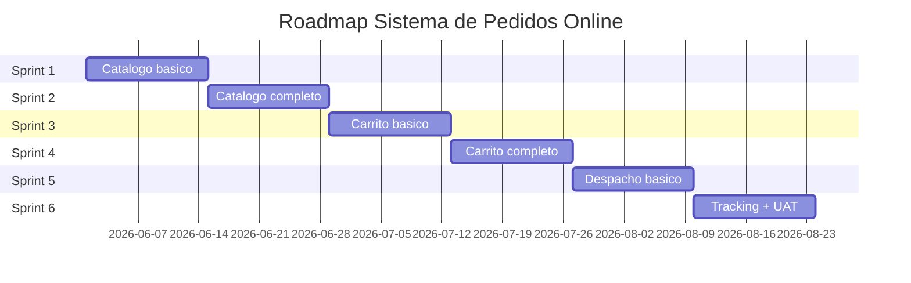

# Roadmap de Sprints: Sistema de Pedidos Online

## Resumen
6 sprints planificados.

## Tabla de Sprints

| Sprint | Goal | Duracion | Inicio | Fin |
|--------|------|----------|--------|-----|
| 1 | Catalogo basico de productos | 2 semanas | 2026-06-01 | 2026-06-14 |
| 2 | Catalogo completo + busqueda avanzada | 2 semanas | 2026-06-15 | 2026-06-28 |
| 3 | Carrito de compras basico | 2 semanas | 2026-06-29 | 2026-07-12 |
| 4 | Carrito completo + confirmacion | 2 semanas | 2026-07-13 | 2026-07-26 |
| 5 | Modulo de despacho basico | 2 semanas | 2026-07-27 | 2026-08-09 |
| 6 | Tracking + pruebas UAT | 2 semanas | 2026-08-10 | 2026-08-23 |

## Diagrama Gantt

