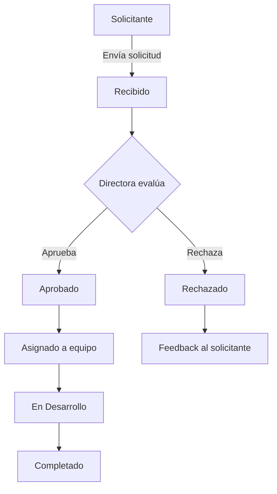
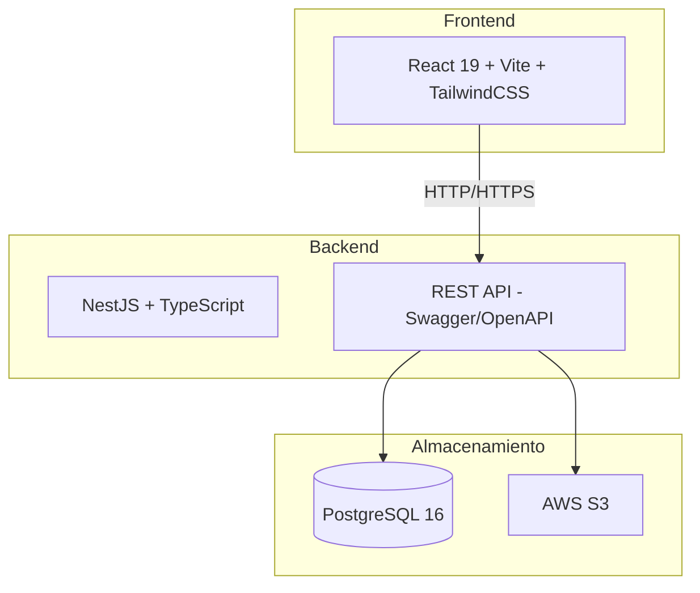

# Sprint 1: Diseño y Arquitectura - Definir wireframes, modelo de datos, arquitectura del sistema y flujos de usuario. Setup del proyecto (repo, CI/CD, entorno dev).

## Equipo
1 Frontend, 1 Backend, 1 QA, 1 Diseñador UX/UI

## Items del Sprint

| Historia | Tareas | Responsable | Estado |
|----------|--------|-------------|--------|
| Como Director Solicitante, quiero seleccionar una categoría visual mediante tarjetas y completar un formulario estandarizado, para enviar una solicitud clara y formal a la mesa de Producto & Tecnología sin usar canales informales. | Diseño UX/UI: wireframes de portal, formulario tipificado y bandeja de aprobación. Backend: modelo de datos (usuarios, solicitudes, estados), seed de roles y tipologías. Frontend: setup del proyecto React + Vite, layout base, componentes de formulario. QA: plan de pruebas, casos de uso críticos. | Diseñador UX/UI (wireframes), Backend (modelo BD + setup), Frontend (setup proyecto + componentes base), QA (plan de pruebas) | Pendiente |
| Como Directora de Producto & Tecnología, quiero visualizar el listado de solicitudes pendientes y tener la opción de aprobarlas o rechazarlas, para controlar estratégicamente el ingreso de requerimientos a mi área. | Frontend: implementación formulario con categorías, carga de archivos, validación. Backend: endpoints CRUD de solicitudes, integración S3 para archivos. QA: pruebas de envío, validación y subida de archivos. UX/UI: refinamiento visual del portal. | Frontend (formulario), Backend (API + S3), QA (testing funcional), UX/UI (refinamiento visual) | Pendiente |

## Definition of Done
- Codigo completado y revisado
- Pruebas unitarias pasan
- Documentacion actualizada
- Despliegue en entorno de pruebas

## Diagramas

### Diagrama de flujo del ciclo de vida de una solicitud

### Diagrama de arquitectura de componentes

