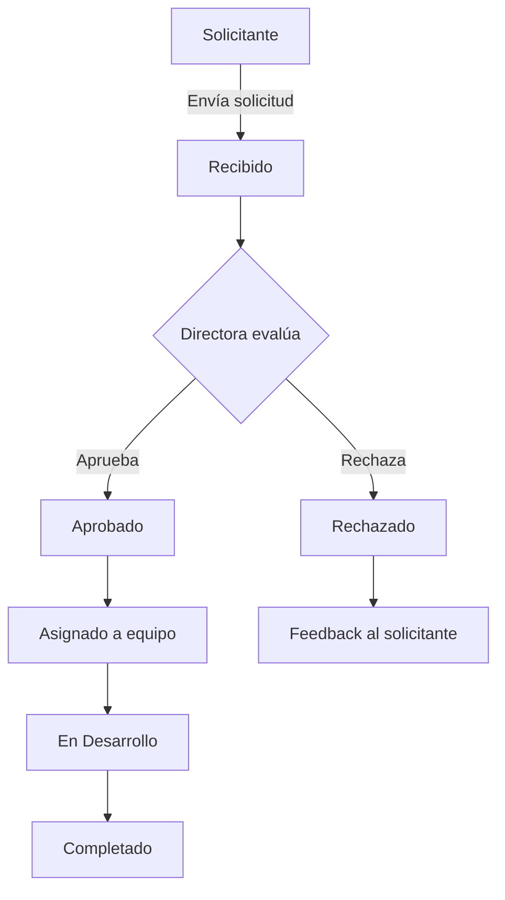
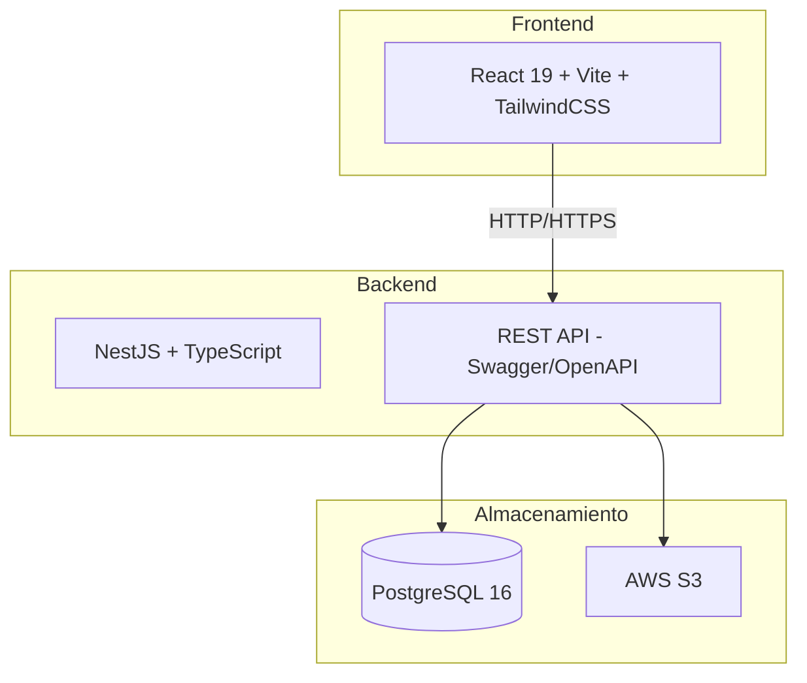
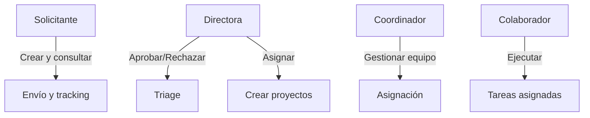

# Presentacion Ejecutiva: Sistema de gestion - Producto & Tecnología

## Pitch ejecutivo
Actualmente la Mesa de Producto y Tecnología recibe solicitudes por chats, correos y pasillo. Implementaremos un Sistema de Gestión centralizado que actúa como embudo inteligente: Fase 1 estandariza la carga y aprobación de solicitudes interdepartamentales, Fase 2 las transforma en proyectos internos con asignación de equipo. Eliminamos el ruido operativo, reducimos tiempos de respuesta y alineamos el 100% del esfuerzo del equipo a los objetivos de negocio.

## Stakeholders

**Involucrados:** CEO
**Matriz poder-interes:** CEO - Alto poder, Alto interés
**Decisor del presupuesto:** CEO
**Aprobador de cambios:** CEO
**Frecuencia de comunicacion:** Reuniones semanales
**Canal de comunicacion:** Reporte de estado semanal

## Analisis de Riesgos

| Tipo | Descripcion |
|------|-------------|
| Mercado | ninguno |
| Legal / Normativo | ninguno |
| Adopcion | Riesgo alto: directores pueden ignorar la plataforma y continuar usando canales informales. Mitigación: comunicado oficial del CEO, diseño con fricción cero, onboarding guiado, incentivos visibles (tracking de solicitudes, respuesta más rápida). |
| Dependencia externa | Riesgo medio: dependencia de la Directora para triage inicial. Si no revisa solicitudes, se acumulan. Mitigación: notificaciones push/email, alertas por tiempo sin revisar, delegación temporal a Coordinador como backup. |

## Justificacion de negocio

**Estrategia:** Construcción Interna (In-house). No se compra SaaS porque parametrizar Jira/Monday al flujo exacto requiere licencias costosas. No se terceriza porque es el núcleo estratégico del área. Se construye in-house porque tenemos el equipo (UX, Front, Back, QA) y necesitamos control total, escalabilidad y adaptación al proceso de la empresa.
**ROI estimado:** ROI de Eficiencia: (Tiempo Ahorrado en Gestión + Reducción de Errores/Retrabajo) / Costo de Desarrollo Interno. Ahorro estimado de 15h semanales de roles gerenciales, reducción de retrabajo técnico en 25%.
**Competidores / Alternativas:** Jira Service Management / Zendesk vs Formularios de Google + Trello. Diferencia: Son plataformas complejas y costosas o soluciones desconectadas que rompen la trazabilidad.
**Analisis FODA:** Fortalezas: conocimiento del proceso, interfaz simplificada (<2 min carga), flujo jerárquico blindado. Oportunidades: estandarizar cultura de trabajo, escalabilidad lingüística, activo tecnológico propio. Debilidades: uso de horas de desarrollo propio (costo de oportunidad), dependencia inicial de la Directora para triage. Amenazas: resistencia al cambio de otros directores, sobrecarga de la Directora.
**Peor escenario si no se hace:** Resistencia extrema a la adopción: directores ignoran la plataforma y siguen usando canales informales. Mitigación: 1) Apoyo del CEO con comunicado oficial. 2) Fricción cero en interfaz para que sea más cómodo que un email.

## Metricas de exito

| Categoria | Indicadores |
|-----------|-------------|
| Producto | Cumplimiento del flujo de solicitud interdepartamental: cero solicitudes por canales informales, 100% canalizadas por la plataforma |
| Tecnicas | Tiempo de carga promedio < 2s (Lighthouse). Cobertura de tests unitarios > 80%. Tasa de errores en producción < 1%. Disponibilidad del sistema > 99.5% (uptime). Tiempo de respuesta API (p95) < 500ms. Tasa de éxito de entregas de notificaciones email > 95%. |
| Negocio | Gestión de proyectos dentro de la mesa, reducción de tiempo de procesamiento y asignación |

## Cronograma de hitos
Hito 1 (05 Jun 2026): Cierre de Diseño y Arquitectura. Hito 2 (17 Jul 2026): MVP en producción (Fase 1). Hito 3 (04 Sep 2026): Fase 2 - Panel Interno. Hito 4 (23 Oct 2026): Auditoría e Internacionalización.

## Equipo requerido
1 Frontend, 1 Backend, 1 QA, 1 Diseñador UX/UI

## Diagramas

### Diagrama de flujo del ciclo de vida de una solicitud

### Diagrama de arquitectura de componentes

### Diagrama de roles y permisos (RBAC)

