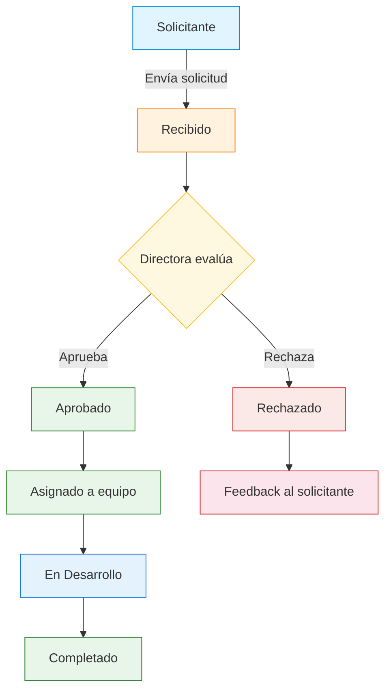
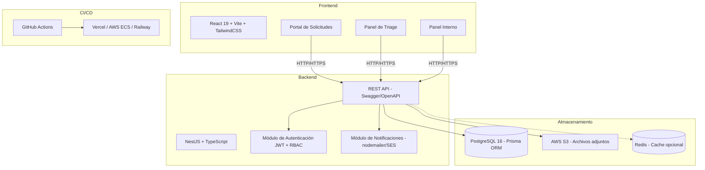
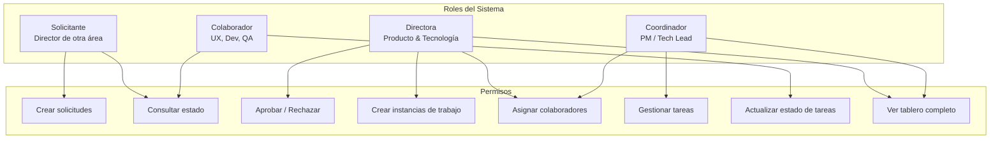

# Vision del Producto: Sistema de gestion - Producto & Tecnología

## Problema
La recepción de requerimientos desde otras direcciones hacia el área de Producto & Tecnología carece de un canal unificado, estructurado y estandarizado. Esto genera falta de gobernanza, falta de categorización (no se diferencian solicitudes estratégicas de operativas) y desconexión en el ciclo de vida entre la aprobación y la ejecución.

## Solucion propuesta
Plataforma modular en dos fases: Fase 1 - Panel de Solicitudes Interdepartamentales (interfaz externa para que directores envíen solicitudes estandarizadas bajo tipologías) y Fase 2 - Panel de Distribución Interna y Ejecución (panel de control interno para transformar solicitudes aprobadas en proyectos con asignación de colaboradores).

## Objetivos del negocio
Optimizar Time-to-Market, eficiencia operativa reduciendo tiempo administrativo de dirección, trazabilidad y visibilidad del estado de requerimientos (Recibido → Evaluado → Asignado → En Desarrollo).

## Publico objetivo
Usuarios Externos: Directores de otros departamentos (solicitantes). Usuario Administrador Principal: Directora de Producto & Tecnología (aprobador). Usuarios Internos: Colaboradores y equipos técnicos de la Mesa (ejecutores).

## Criterios de exito
Centralización del 100% de solicitudes interdepartamentales en primer mes. Reducción en tiempo de procesamiento y asignación interna. Satisfacción de directores solicitantes gracias a claridad en el estado de sus pedidos.

## Tecnologia sugerida
Frontend: React 19 + TypeScript + Vite + TailwindCSS. Backend: Node.js 22 + NestJS + TypeScript. Base de datos: PostgreSQL 16. ORM: Prisma. Autenticación: JWT + RBAC. Almacenamiento: AWS S3 (archivos adjuntos). Notificaciones: nodemailer + AWS SES. CI/CD: GitHub Actions. Hosting: AWS ECS / Vercel (Frontend) + Railway o AWS EC2 (Backend). Metodología: REST API documentada con Swagger/OpenAPI.

## Diagramas

### Diagrama de flujo del ciclo de vida de una solicitud

### Diagrama de arquitectura de componentes

### Diagrama de roles y permisos (RBAC)

