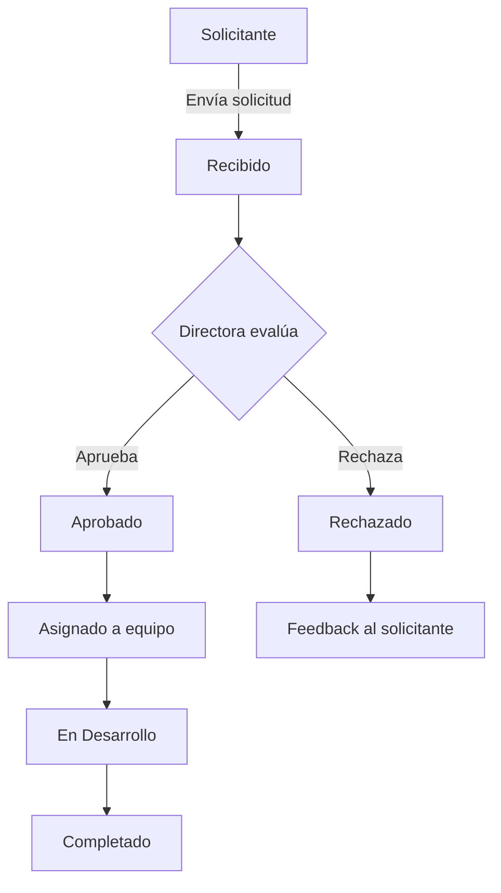
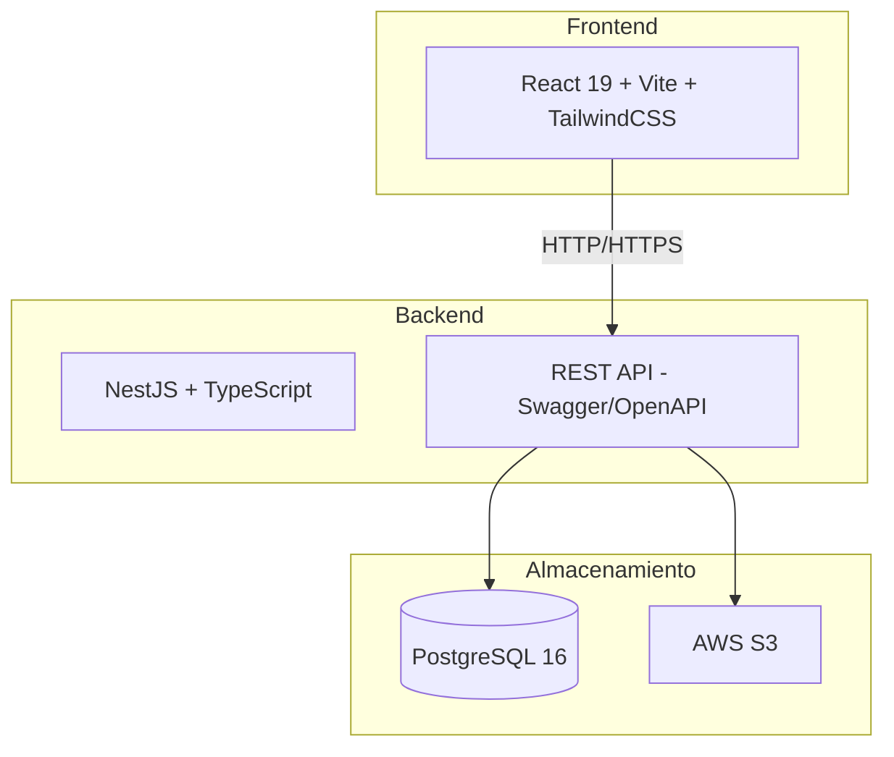
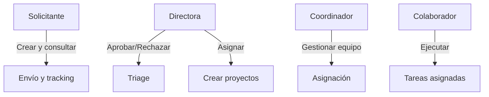

# Requerimientos Funcionales: Sistema de gestion - Producto & Tecnología

## Epicas del proyecto

| ID | Epica | Descripcion | Prioridad | Dependencias |
|----|-------|-------------|-----------|--------------|
| E-01 | F01: Portal de Carga y Clasificación de Solicitudes | Interfaz externa que permite a los Directores Solicitantes rellenar un formulario estandarizado basado en tipologías clave (Nuevo producto, Error, Soporte, etc.), adjuntar archivos y enviar la solicitud formal a la mesa. | MUST | Ninguna |
| E-02 | F02: Módulo de Triage y Gobernanza Directiva | Panel exclusivo para la Directora de Producto & Tecnología donde recibe las solicitudes entrantes, visualiza su detalle completo y ejecuta Aprobar o Rechazar (con feedback obligatorio en rechazo). | MUST | F01 |
| E-03 | F03: Panel Interno de Asignación y Distribución Operativa | Tablero de control que permite a la Directora y Coordinadores transformar una solicitud Aprobada en proyecto/instancia de trabajo, asignando colaboradores (UX, Devs, QA) y definiendo flujos de entrega. | SHOULD | F02 |

## MVP (Minimum Viable Product)
MVP enfocado estrictamente en Fase 1: login básico por roles, portal de carga y formulario estandarizado (F01), bandeja de aprobación/rechazo para la Directora (F02), historial de estados para solicitantes, notificaciones automáticas por email. NO incluye: tablero Kanban, métricas avanzadas, integraciones con terceros.

## Roadmap
Sprint 1 (19 May - 1 Jun): Diseño y Arquitectura. Sprint 2 (2 Jun - 15 Jun): MVP F01 - Portal de Carga. Sprint 3 (16 Jun - 29 Jun): MVP F02 - Triage y Aprobación. Sprint 4 (30 Jun - 13 Jul): QA, Testing, Ajustes finales y Release MVP (17 Jul). Sprint 5 (14 Jul - 27 Jul): F03 Panel Interno (backend + asignación). Sprint 6 (28 Jul - 10 Ago): F03 Tablero operativo y entrega Fase 2 (04 Sep).

## Diagramas

### Diagrama de flujo del ciclo de vida de una solicitud

### Diagrama de arquitectura de componentes

### Diagrama de roles y permisos (RBAC)

