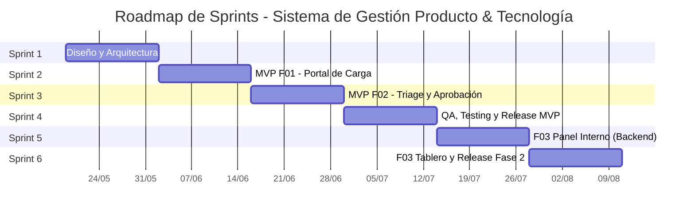

# Roadmap de Sprints: Sistema de gestion - Producto & Tecnología

## Resumen
6 sprints planificados.

## Tabla de Sprints

| Sprint | Goal | Duracion | Inicio | Fin |
|--------|------|----------|--------|-----|
| Sprint 1 | Diseño y Arquitectura - Definir wireframes, modelo de datos, arquitectura del sistema y flujos de usuario. Setup del proyecto (repo, CI/CD, entorno dev). | 2 semanas | 2026-05-19 | 2026-06-01 |
| Sprint 2 | MVP F01 Portal de Carga - Formulario estandarizado con tipologías, autenticación de solicitantes, validación de campos, carga de archivos (S3), y guardado en BD. | 2 semanas | 2026-06-02 | 2026-06-15 |
| Sprint 3 | MVP F02 Triage - Bandeja de aprobación/rechazo para Directora, cambio de estados, feedback obligatorio en rechazo, notificaciones por email. | 2 semanas | 2026-06-16 | 2026-06-29 |
| Sprint 4 | QA Integral, Testing E2E, corrección de bugs, pulido UX, documentación de usuario, despliegue en producción del MVP (17 Jul). | 2 semanas | 2026-06-30 | 2026-07-13 |
| Sprint 5 | F03 Panel Interno (Parte 1) - Creación de instancias de trabajo desde solicitud aprobada, asignación de colaboradores por perfil, tabla de proyectos activos. | 2 semanas | 2026-07-14 | 2026-07-27 |
| Sprint 6 | F03 Panel Interno (Parte 2) - Tablero de control con vistas por colaborador, actualización de estados por parte del equipo, filtros y búsqueda. Release Fase 2. | 2 semanas | 2026-07-28 | 2026-08-10 |

## Diagrama Gantt

